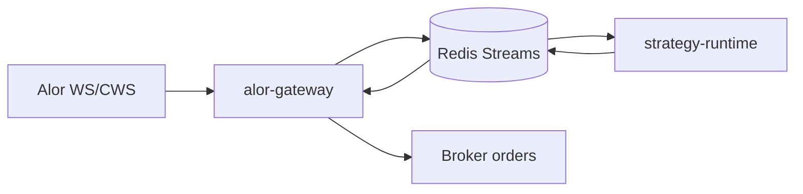
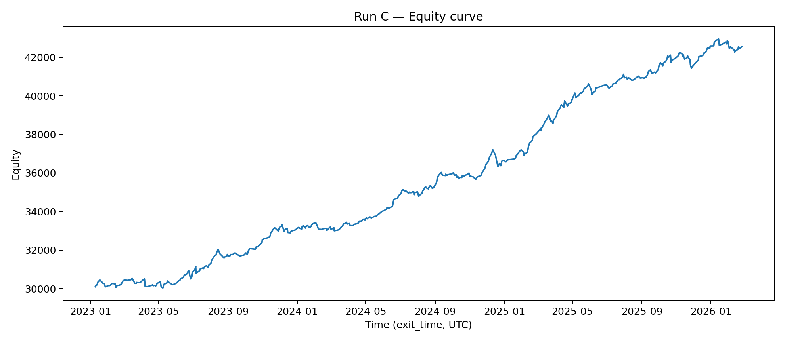

# alor-rust-project

A Rust trading workspace for MOEX/Alor integration.

---

## What it is

- **Gateway (`alor-gateway`)**: WS/CWS integration, reconnect/resubscribe, health endpoints, market schedule awareness.
- **Runtime (`strategy-runtime`)**: strategy execution in `paper` / `live` / `replay` modes.
- **Transport**: Redis Streams as the contract between gateway and runtime.

> Main project code and runbooks live in `./alor-rs-main/`.

---

## Architecture



---

## ⚠️ Rule #1: configs

**All active TOML configs must be taken from `./alor-rs-main/configs/`.**
Any `.toml` outside that directory is legacy and should not be used for launches.

---

## Quickstart (2 minutes)

### 1) Enter project folder

```bash
cd ./alor-rs-main
```

### 2) Start Redis (Docker)

```bash
docker run --rm -p 6379:6379 redis:7-alpine
```

### 3) Start gateway (terminal #1)

```bash
RUST_LOG=info,alor_gateway::supervisor=info \
cargo run -p alor-gateway --bin alor_gateway_transport_runner -- \
  --config ./configs/gateway.live.toml \
  --redis-url redis://127.0.0.1/
```

### 4) Start runtime in paper mode (terminal #2)

```bash
RUST_LOG=info,strategy_runtime=info \
cargo run -p strategy-runtime --bin strategy_runtime_runner -- \
  --config ./configs/runtime.paper.toml
```

### 5) Health checks

```bash
curl -sf http://127.0.0.1:8081/liveness
curl -sf http://127.0.0.1:8081/readiness
curl -sf http://127.0.0.1:8091/liveness
curl -sf http://127.0.0.1:8091/readiness
```

---

## Reliability / Ops

- **Readiness semantics**: `/readiness` may return `503` while service is not ready (expected for orchestration).
- **Liveness semantics**: `/liveness` reports process aliveness.
- **Reconnect/resubscribe**: gateway handles reconnect loops and subscription recovery.
- **Scheduler/trading_periods**: market windows configured via `trading_periods` in configs.
- **Graceful shutdown**: runtime/gateway support controlled shutdown flow.

For k8s probes use:
- `startupProbe` + `livenessProbe` -> `/liveness`
- `readinessProbe` -> `/readiness`

---

## Tests

From `./alor-rs-main`:

```bash
cargo test -p strategy-runtime --lib
cargo test -p alor-gateway --lib
```

Integration tests using Docker/testcontainers (Redis transport):

```bash
RUN_DOCKER_TESTS=1 cargo test -p alor-gateway --test redis_transport
```

---

## Examples / Demo

<details>
<summary><strong>Example backtest results (sample strategy)</strong></summary>

> Backtest for a sample strategy running on top of this gateway/runtime.
> Results are provided for reproducibility and system validation only — not a performance guarantee.
> Assumptions: see full report (`reports/run_c/summary.md`) for data/parameters/limitations.

**Period:** 2023-01-09 → 2026-02-24 (UTC)
**Trades:** 439

| Metric | Value |
|---|---:|
| Starting capital | 30,000 |
| Ending capital | 42,558 |
| Total return | 41.86% |
| Net PnL | 12,558.20 |
| Win rate | 71.98% |
| Profit factor | 1.85 |
| Max drawdown | -2.37% (-883) |
| Sharpe (daily, ffill days) | 2.38 |
| CAGR (est.) | 11.70% |
| Avg / Median PnL | 28.60 / 51.71 |
| Avg / Median per trade (bps notional) | 9.70 / 17.74 |
| Avg / Median holding time | 3.91h / 2.75h |



Full report: `reports/run_c/summary.md`

</details>

---

## Roadmap / Limitations

- Backtest metrics above are **example/demo** only and must not be interpreted as live performance guarantees.
- Reproducibility depends on fixed data snapshot, config, and binary commit; keep them pinned in reports.
- Docker-backed integration tests are opt-in in constrained CI/pod environments.

## Audit Status

Critical audit for `gateway + strategy-runtime` is completed, and first-wave failure scenarios are executed and tracked.

- Main findings/roadmap: `./alor-rs-main/docs/AUDIT_AND_ROADMAP_GATEWAY_RUNTIME.md`
- Execution status by scenario: `./alor-rs-main/docs/failure-test-matrix.md`

---

## Where to go next

- Main README (project-internal): `./alor-rs-main/README.md`
- Gateway runbook: `./alor-rs-main/docs/alor-gateway-runbook.md`
- Runtime runbook: `./alor-rs-main/docs/strategy-runtime-runbook.md`
- DevOps paper runbook: `./alor-rs-main/docs/devops-paper-runbook.md`
- Replay/backtest guide: `./alor-rs-main/docs/replay-backtest-guide.md`
- State and restarts: `./alor-rs-main/docs/state-and-restarts.md`
